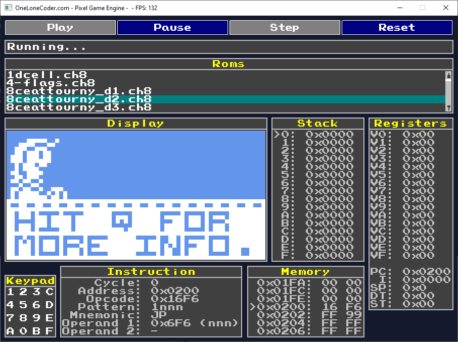

# Description

A CHIP-8 emulator built with the [OneLoneCoder PixelGameEngine](https://github.com/OneLoneCoder/olcPixelGameEngine).  
The project leans into retro aesthetics and provides straightforward debug menus that make emulator behavior easy to explore.



---

## Features

- **Retro aesthetics** – CRT-style pixel rendering for an authentic look
- **ROM browser** – quick selection of `.ch8` files
- **Execution controls** – Play, Pause, Step, and Reset
- **Debug panels**:
  - **Display** – live CHIP-8 screen output
  - **Stack** – inspect the full call stack
  - **Registers** – real-time values for V0–VF, PC, I, DT, and ST
  - **Instruction** – cycle count, opcode, operands, mnemonic, and decoded pattern
  - **Memory** – hex viewer around the current program counter
  - **Keypad** – virtual CHIP-8 keypad (0–F)
- **Testing** – unit tests with GoogleTest + GoogleMock
- **Cross-platform** – builds on Windows, Linux, and macOS with CMake

---

## Prerequisites

- CMake **3.20+**
- C++20 compatible compiler  
  - MSVC with `/W4 /permissive-`  
  - or GCC/Clang with `-Wall -Wextra -pedantic -Wconversion`
- [GoogleTest v1.17.0](https://github.com/google/googletest) (fetched automatically)
- [OneLoneCoder PixelGameEngine (PGE)](https://github.com/OneLoneCoder/olcPixelGameEngine) (included under `vendor/PGE`)

**Optional:**
- CHIP-8 ROMs in a `roms/` directory (path is auto-configured in non-production builds)

---

## Build Instructions

```bash
# Clone the repository
git clone https://github.com/twje/cpp_chip8_course_code.git
cd cpp_chip8_course_code

# Create build directory
mkdir build && cd build

# Configure with CMake
cmake ..

# Build all targets
cmake --build .
